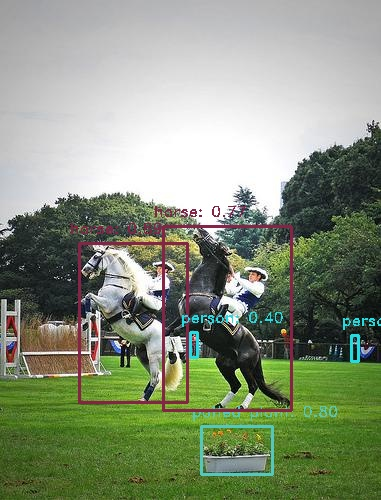
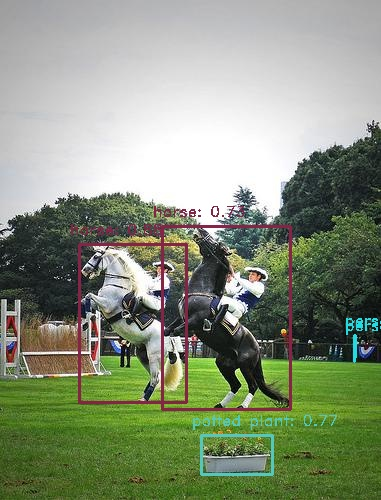
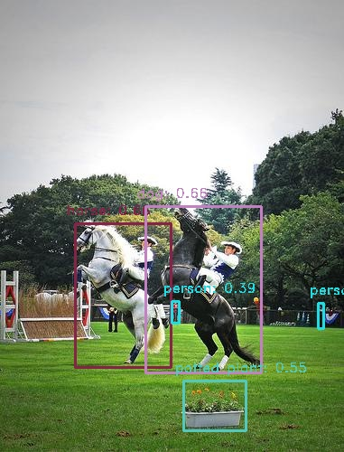

# YOLOv8s-Pruning-Quantization

## Description

This project performs unstructured pruning, dynamic quantization, static quantization on the YOLOv8s model. It times and tests the accuracy of the model during inference after applying the optimization techniques.

## Outline of Repository
```bash
├── data/ 
│   ├── calibrate/ # Calibration dataset for static quantization
│   │   └──  *.jpg
│   ├── images/ # images for inference
│   │   └──  *.jpg
│   └── labels/ # .txt files of labels for images
│       └──  *.jpg
├── models/ # The models being tested
│   ├── *.onnx
│   └──  *.pt 
├── outputs/ # Labeled images from each mode
│   ├── dynamic_quantized/
│   │   └──  *.jpg
│   ├── pruned/
│   │   └──  *.jpg
│   ├── static_quantized/
│   │   └── *.jpg
│   └── yolov8s/
│       └──  *.jpg
├── Optimization.ipynb # Notebook that optimizes and runs all experiments   
├── requirements.txt # Python dependencies 
└── README.md # Project documentation
```
## To Execute
1. Clone the repository
2. Install requirements.txt
   ```bash
   pip install -r requirements.txt
   ```
3. Run all cells in 'Optimization.ipynb'

## Results
|Model|mAP|Inference Time(s)|Avg. Inference Time(s)|
|---|---|---|---|
|YOLOv8s|0.39|15.96|0.13|
|Pruned|0.28|15.92|0.13|
|Dynamic Quantization|0.39|23.66|0.19|
|Static Quantization|0.32|11.85|0.09|


|YOLOv8s|Pruned YOLOv8s|Dynamic Quantized YOLOv8s|Static Quantized YOLOv8s|
| ------------- | -------------| -------------| -------------|
|||||
